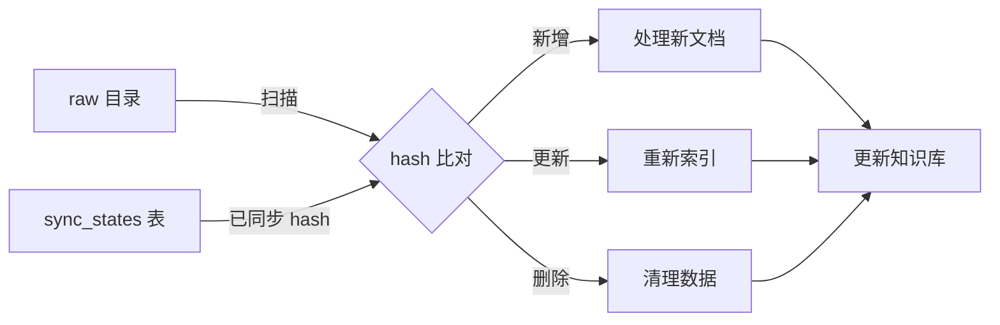

# Ninja RAG 架构说明

## 🏗️ 核心概念

系统基于**三层数据架构**设计，清晰区分数据生命周期：

```
源文档 (Raw) → 已加载文档 (Loaded) → 知识库 (Knowledge Base)
```

### 1. **源文档 (Raw Documents)**
- **定义**: `data/raw/wiki/` 目录下的原始 JSON 文件
- **来源**: 维基百科 API 抓取的原始数据
- **结构**: `类别/文档名/parse.json` + `pageprops.json`
- **特点**:
  - 不可被系统修改
  - 用户手动管理（添加/修改/删除）
  - 系统只读取用于对比

### 2. **已加载文档 (Loaded Documents)**
- **定义**: MySQL `documents` 表中的结构化记录
- **来源**: 从源文档解析并存储
- **作用**:
  - 用于增量同步的基准（对比 hash）
  - 记录文档元数据（标题、分类、章节等）
  - 查询时展示文档信息

### 3. **知识库 (Knowledge Base)**
- **定义**: Milvus 向量 + Neo4j 图谱
- **来源**: 从已加载文档生成
- **作用**:
  - Milvus: 向量检索（稠密 + 稀疏混合）
  - Neo4j: 知识图谱关系推理
  - 实际查询时使用的数据

---

## 🔄 同步流程

### 增量同步（唯一同步方式）



**核心逻辑**:
1. 扫描 `data/raw/wiki/` 目录，计算每个文件的 MD5 hash
2. 与 `sync_states` 表中存储的 hash 对比
3. 识别变更类型：
   - **新增**: `sync_states` 中不存在的文件
   - **更新**: hash 不一致的文件
   - **删除**: 数据库有记录但文件已删除
4. 对变更文档执行：
   - 解析 JSON → 保存到 MySQL
   - 分块 → 向量化 → 存入 Milvus
   - 提取实体关系 → 构建 Neo4j 图谱
   - 更新 `sync_states` 表

### 全量同步实现方式

**方法**: 先清空知识库 + 再增量同步

```bash
# 方式 1: 使用 API（推荐）
POST /api/sync/clear/all        # 清空所有数据
POST /api/sync/incremental/stream  # 增量同步（对空库来说 = 全量）

# 方式 2: 使用前端
点击"清空所有数据" → 点击"与源文档同步"
```

**为何不再区分全量/增量**:
- 增量同步已包含新增逻辑
- 对空知识库执行增量 = 全量导入
- 避免代码重复和维护负担

---

## 🗑️ 清空操作

### 清空知识库 (Clear Knowledge Base)

```http
POST /api/sync/clear/knowledge
```

**删除内容**:
- ✅ Milvus 向量数据
- ✅ Neo4j 图谱节点和关系

**保留内容**:
- ✅ MySQL `documents` 表（已加载文档）
- ✅ MySQL `sync_states` 表（同步状态）

**使用场景**:
- 修改了向量模型或图谱算法，需重新生成
- 向量库损坏需重建
- 测试检索效果对比

**后续操作**:
清空后执行增量同步，系统会重新生成向量和图谱。

---

### 清空所有数据 (Clear All Data)

```http
POST /api/sync/clear/all
```

**删除内容**:
- ✅ MySQL `documents` 表
- ✅ MySQL `sync_states` 表
- ✅ Milvus 向量数据
- ✅ Neo4j 图谱节点和关系

**保留内容**:
- ✅ `data/raw/wiki/` 源文档（不受影响）

**使用场景**:
- 完全重置系统
- 更换数据源
- 修复数据损坏

**后续操作**:
清空后执行增量同步，系统会从零开始重新索引所有源文档。

---

## 📊 前端架构

### 赛博朋克霓虹美学设计

**设计灵感**: 银翼杀手 + 日本霓虹 + 黑客帝国
**配色方案**:
- 深黑底色: `#0a0a0f`
- 霓虹青: `#00f3ff` (主色，用于用户/系统)
- 霓虹品红: `#ff00ff` (次色，用于助手/分类)
- 全息蓝: `#4d4dff` (辅助色)
- 危险红: `#ff0055` (警告操作)

**核心元素**:
- 六边形网格背景
- 全息扫描线动画
- 半透明毛玻璃卡片
- 霓虹边框光效
- 数据流动效果
- 故障艺术 (glitch)

### 页面结构

#### 1. 查询界面 (`/`)

```
┌─────────────────────────────────────┐
│  NINJA RAG                          │  ← 导航栏
├─────────────────────────────────────┤
│  ┌───────────────────────────────┐  │
│  │ 中央输入框（霓虹边框）        │  │
│  └───────────────────────────────┘  │
│                                     │
│  [用户消息气泡 - 青色边框]         │
│  [AI 回复气泡 - 品红色边框]        │
│    ├─ 置信度进度条                 │
│    ├─ 查看上下文按钮               │
│    └─ 检索来源列表                 │
└─────────────────────────────────────┘
```

**功能亮点**:
- 实时打字机效果
- 置信度可视化（渐变进度条）
- 模态框查看完整提示词
- 向量检索 + 图谱推理双面板

#### 2. 管理界面 (`/admin`)

```
┌────────────────────────────────────────┐
│ 📁 源文档 | 💾 已加载文档 | 🧠 知识库 │ ← 状态卡片
├────────────────────────────────────────┤
│ 系统操作:                              │
│ [与源文档同步] [增量同步]             │ ← 主操作
│ [清空知识库] [清空所有数据]           │ ← 危险操作
│                                        │
│ 实时日志终端 ──────────────            │ ← SSE 流式日志
│ [INFO] 扫描完成: 30 个文件             │
│ [INFO] 处理中: 火影忍者                │
│ [SUCCESS] 同步完成                     │
├────────────────────────────────────────┤
│ 📚 文档列表                            │
│ [全部] [作品] [角色] [概念]           │ ← 分类筛选
│ ┌────┐ ┌────┐ ┌────┐                  │
│ │文档│ │文档│ │文档│ ...              │ ← 文档卡片网格
│ └────┘ └────┘ └────┘                  │
└────────────────────────────────────────┘
```

**功能亮点**:
- 三大核心概念实时统计
- SSE 流式进度显示
- 危险操作二次确认
- 分类筛选和搜索

---

## 🔧 技术栈

### 后端

| 组件 | 技术 | 说明 |
|------|------|------|
| **Web 框架** | FastAPI | 异步高性能 |
| **文档存储** | MySQL | 结构化数据 |
| **向量数据库** | Milvus | 稠密 + 稀疏混合检索 |
| **图数据库** | Neo4j | 知识图谱 |
| **嵌入模型** | BGE-Large-ZH | 稠密向量 |
| **稀疏检索** | BM25 + jieba | 关键词匹配 |
| **LLM** | 通义千问 | 答案生成 + HyDE |

### 前端

| 组件 | 技术 | 说明 |
|------|------|------|
| **模板引擎** | Jinja2 | 服务端渲染 |
| **样式** | 纯 CSS | 无框架依赖 |
| **字体** | Orbitron + JetBrains Mono | 未来感 |
| **交互** | Vanilla JS | 轻量高效 |
| **实时通信** | SSE (EventSource) | 进度流 |

---

## 📁 目录结构

```
ninja-rag/
├── data/
│   └── raw/
│       └── wiki/          # 源文档目录
│           ├── 作品/
│           │   └── 火影忍者/
│           │       ├── parse.json
│           │       └── pageprops.json
│           ├── 角色/
│           └── 概念/
│
├── src/
│   ├── api/               # API 层
│   │   ├── routes/
│   │   │   ├── sync.py    # 同步接口
│   │   │   ├── query.py   # 查询接口
│   │   │   └── status.py  # 状态接口
│   │   └── schemas/
│   │
│   ├── domain/            # 领域层（纯业务逻辑）
│   │   ├── entities/      # 实体
│   │   ├── value_objects/ # 值对象
│   │   └── services/      # 领域服务
│   │
│   ├── service/           # 应用服务层
│   │   ├── sync_service_v2.py      # 增量同步
│   │   ├── rag_service.py          # RAG 核心
│   │   ├── hybrid_search_service.py # 混合检索
│   │   ├── bm25_service.py         # 稀疏检索
│   │   └── hyde_service.py         # HyDE 增强
│   │
│   ├── data/              # 数据层
│   │   ├── repositories/  # 仓库接口实现
│   │   ├── mappers/       # 数据映射器
│   │   └── sources/       # 数据源
│   │
│   ├── infrastructure/    # 基础设施层
│   │   ├── external/      # 外部服务客户端
│   │   └── config/        # 配置管理
│   │
│   └── ui/
│       └── templates/     # 前端模板
│           ├── base.html  # 基础布局
│           ├── index.html # 查询界面
│           └── admin.html # 管理界面
│
├── scripts/               # 工具脚本
│   ├── build_bm25_index.py
│   └── migrate_add_hash.py
│
└── docs/                  # 文档
    ├── ARCHITECTURE.md
    ├── HYBRID_SEARCH.md
    └── QUICKSTART.md
```

---

## 🚀 工作流

### 典型使用场景

#### 场景 1: 首次部署

```bash
# 1. 配置环境
cp .env.example .env
# 编辑 .env 填写数据库配置和 API Key

# 2. 启动服务
uv run python src/main.py

# 3. 打开管理页面
http://localhost:8080/admin

# 4. 与源文档同步（首次 = 全量导入）
点击"与源文档同步" → 等待 SSE 进度完成

# 5. 构建 BM25 索引（可选，提升检索效果）
uv run python scripts/build_bm25_index.py

# 6. 开始查询
http://localhost:8080/
```

#### 场景 2: 添加新文档

```bash
# 1. 将新文档放入 raw 目录
data/raw/wiki/角色/宇智波佐助/parse.json

# 2. 执行增量同步
http://localhost:8080/admin
点击"增量同步" → 系统自动识别新文档

# 3. 重建 BM25 索引
uv run python scripts/build_bm25_index.py
```

#### 场景 3: 修改检索策略

```bash
# 1. 修改 .env 配置
DENSE_WEIGHT=0.6  # 增加向量权重
SPARSE_WEIGHT=0.4 # 减少 BM25 权重
USE_HYDE=true     # 启用 HyDE

# 2. 重启服务
uv run python src/main.py

# 3. 测试效果
# 无需重新索引，配置即时生效
```

#### 场景 4: 重建知识库

```bash
# 1. 清空知识库
http://localhost:8080/admin
点击"清空知识库" → 确认

# 2. 重新同步
点击"与源文档同步"

# 3. 重建 BM25
uv run python scripts/build_bm25_index.py
```

---

## 🎯 设计原则

1. **单向数据流**: Raw → Loaded → Knowledge Base
2. **幂等性**: 多次同步同一文档结果一致
3. **增量优先**: 基于 hash 精确比对，避免无意义处理
4. **低耦合**: 数据层、领域层、应用层严格分离
5. **可观测性**: SSE 实时进度 + 日志终端
6. **用户友好**: 危险操作二次确认 + 清晰状态展示

---

## 🔮 扩展性

系统设计考虑了以下扩展点：

1. **多数据源**: 易于添加新的文档源（如 PDF、Markdown）
2. **多模型**: 支持切换不同的 embedding 和 LLM
3. **多检索策略**: 可添加更多检索算法（如 ColBERT）
4. **分布式**: Milvus 和 Neo4j 天然支持集群部署
5. **插件化**: 知识图谱提取可使用不同策略

---

## 📝 注意事项

### ⚠️ 数据安全

- **源文档**: 系统**只读**，用户自行备份
- **数据库**: 定期备份 MySQL + Milvus + Neo4j
- **清空操作**: 不可逆，执行前务必确认

### 🔥 性能优化

- BM25 索引缓存在 `.cache/bm25/`
- Milvus 索引类型: IVF_FLAT (可调整)
- 向量检索 top_k 默认 5（可配置）

### 🐛 故障排查

- 日志文件: `app.log`
- 查看实时日志终端
- 检查 SSE 连接状态
- 验证数据库连接

---

**最后更新**: 2026-02-08
**架构版本**: v2.0（基于 Hash 的增量同步）
